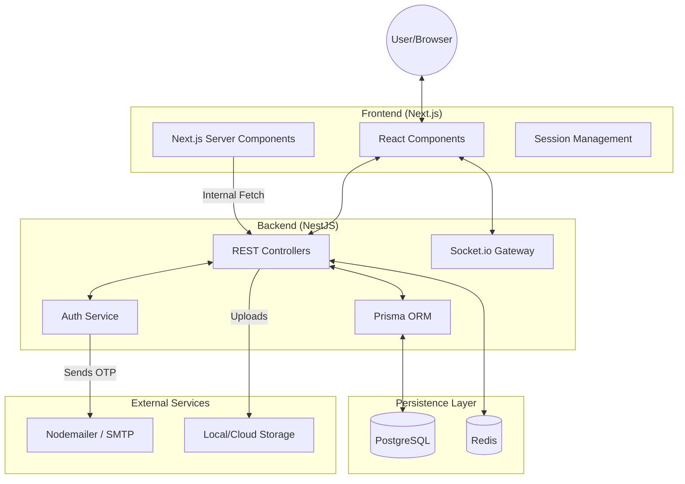

# System Architecture

This document describes the high-level architecture of the Breadit application, illustrating how the frontend, backend, database, and external services interact.

## 1. High-Level Overview

Breadit follows a decoupled **Client-Server Architecture** with a Next.js frontend and a NestJS backend. Communication primarily occurs over HTTP (REST) and WebSockets (Real-time).

---

## 2. Component Responsibilities

### Frontend (Next.js)
- **SSR (Server-Side Rendering):** Server Components fetch initial data directly from the backend API using internal networking (bypassing the public internet).
- **CSR (Client-Side Rendering):** React components handle user interactivity, state management (TanStack Query), and real-time updates.
- **Session Forwarding:** For SSR requests, the frontend forwards the `breadit_session` cookie to the backend to maintain user context.

### Backend (NestJS)
- **API Layer:** Exposes RESTful endpoints for all business logic (Posts, Users, Communities, etc.).
- **Real-time Layer:** Uses Socket.io to push notifications and messages to connected clients.
- **Security:** Implements JWT validation, Role-Based Access Control (RBAC), and Throttling (Rate Limiting).
- **ORM (Prisma):** Acts as the interface between the application logic and the PostgreSQL database.

### Persistence Layer
- **PostgreSQL:** The primary relational database for all structured data (Users, Posts, Relationships).
- **Redis:** Used for caching and potentially as a message broker for Socket.io scaling.

### External Actors
- **SMTP Server:** Handles outgoing transactional emails (Verification codes, Password reset links).
- **Storage:** Handles file uploads for profile pictures and post media.

---

## 3. Communication Patterns

### Authentication Flow (JWT + Cookies)
1. User provides credentials.
2. Backend validates and returns a **JWT** in an `httpOnly` cookie named `breadit_session`.
3. Subsequent requests (both from Client and Server Components) include this cookie.

### Real-time Notifications
1. An action occurs in the API (e.g., a new "Like").
2. The `NotificationsService` emits an event.
3. The `NotificationsGateway` (Socket.io) identifies the recipient's active socket.
4. The notification is pushed instantly to the user's browser.

### Data Fetching Strategy
- **Initial Load:** Server Components perform `serverFetch` to minimize TTI (Time to Interactive).
- **Dynamic Content:** Client-side TanStack Query handles pagination (Infinite Scroll) and optimistic updates.
