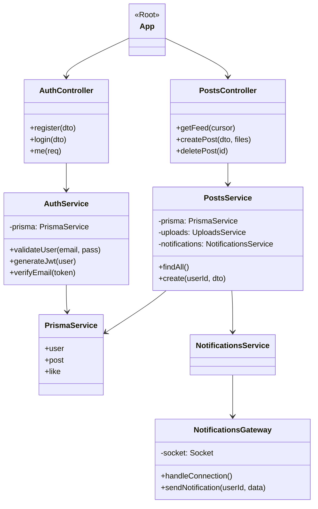

# Class Diagram & System Operation

This document explains the structural design of Breadit, focusing on how TypeScript classes and modules interact across the backend and frontend.

## 1. Backend Architecture (NestJS)

The backend follows the standard NestJS modular architecture, utilizing Dependency Injection (DI) to manage singleton services.

### Core Class Types:
- **Modules:** Orchestrate the dependency graph (e.g., `AuthModule` provides `AuthService` to `AuthController`).
- **Controllers:** Handle incoming HTTP requests, validate input via DTOs, and delegate logic to Services.
- **Services:** Contain the core business logic and interact with the database via `PrismaService`.
- **Gateways:** Manage WebSocket connections for real-time bidirectional communication.
- **Guards:** Intercept requests to handle Authentication (JWT) and Authorization (Roles/Bans).

### Backend Class Diagram (Mermaid)

---

## 2. Frontend Architecture (React/Next.js)

The frontend uses a combination of Functional Components, Hooks, and Providers to manage state and UI.

### Operation Flow:
1. **Providers:** Wrap the application to provide global state (e.g., `SessionProvider` for user auth, `QueryClientProvider` for server state).
2. **Server Components:** Execute on the server to perform initial data fetching (`serverFetch`).
3. **Client Components:** Handle user events (clicks, form submits) and manage local UI state.
4. **Hooks:** Encapsulate reusable logic (e.g., `useSession` for auth data, `useMutation` for API calls).

---

## 3. Cross-Cutting Concerns: TypeScript Operation

### Shared Types (`packages/shared`)
The project utilizes a shared package to ensure type safety between the frontend and backend.
- **DTOs (Data Transfer Objects):** Define the shape of data sent over the network (e.g., `CreatePostDto`).
- **Interfaces:** Shared model definitions (e.g., `User`, `Post`).

### How TypeScript Files Operate:
1. **Compilation:** TS files are compiled to JS during the build process.
2. **Decorator Metadata:** NestJS uses TypeScript decorators (`@Injectable`, `@Controller`) to metadata-tag classes, allowing the framework to automatically handle instantiation and dependency injection.
3. **Inference:** The Prisma Client generates TypeScript types directly from the `schema.prisma` file, ensuring that database queries are always in sync with the actual database structure.
4. **Validation:** On the backend, `class-validator` uses the TypeScript class definitions of DTOs to perform runtime validation of incoming JSON bodies.
