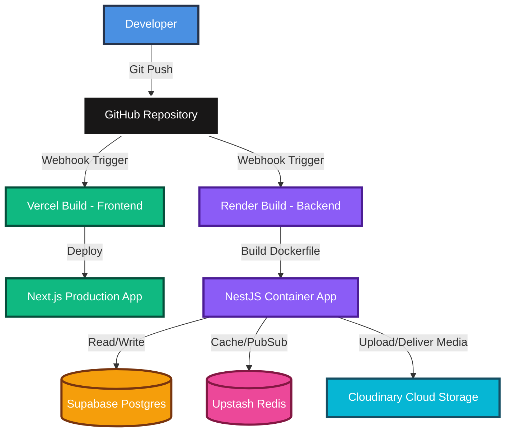

# 3.4.4. Deployment

The Breadit system is designed to be deployed in a cloud environment using the **PaaS (Platform as a Service)** and **Serverless** models. Utilizing specialized cloud services minimizes infrastructure management overhead, automates the CI/CD (Continuous Integration/Continuous Deployment) pipeline, and optimizes performance for each application component.

The physical deployment architecture consists of the following components:
* **Frontend (Next.js):** Deployed on **Vercel** (Serverless & CDN).
* **Backend (NestJS):** Deployed on **Render** (Containerized Web Service).
* **Database (PostgreSQL):** Utilizes the Managed Database service provided by **Supabase**.
* **Cache (Redis):** Utilizes the Serverless Redis service provided by **Upstash**.
* **Media Storage & CDN:** Utilizes the cloud storage and media delivery services of **Cloudinary**.

---

### 3.4.4.1. Workflow

The deployment process is fully automated via Git-webhooks linked directly to the GitHub repository.

#### 3.4.4.1.1. Flow A: (Frontend)
1. **Trigger:** The developer pushes new source code to the `main` branch of the GitHub repository.
2. **Build Pipeline:** Vercel detects modifications within the frontend directory (`apps/frontend/`). An automated build pipeline is triggered on Vercel's infrastructure:
   * Node.js environment initialization.
   * Compiling Next.js source code to a production-ready build (optimizing static pages, server-side routes, and minifying assets).
3. **Deployment:** Once compilation succeeds, the build artifact is deployed and distributed across Vercel’s global Edge CDN network. Vercel's router seamlessly redirects user traffic to the new version without any downtime.

#### 3.4.4.1.2. Flow B: (Backend)
1. **Trigger:** Similarly, a push event to the `main` branch fires a webhook targeting Render.
2. **Docker Build:** Render identifies changes in the backend directory (`apps/backend/`) and reads the configured Dockerfile (`apps/backend/Dockerfile`):
   * A multi-stage Docker build runs to minimize the final container image size.
   * Environment variables such as `DATABASE_URL` (pointing to Supabase) and `REDIS_URL` (pointing to Upstash) are injected during runtime.
3. **Deploy Container:** Render spawns the NestJS backend container from the compiled Docker image. It performs continuous health checking via the `/api/health` endpoint. Once the container responds with a healthy status (`200 OK`), Render routes incoming API traffic to the new container and safely terminates the deprecated instance.

---

### 3.4.4.2. Networking and Security

The network architecture and security configurations are rigidly established to guarantee user data protection:
* **Transport Layer Security (HTTPS/WSS):** All connections from user browsers to the Frontend (Vercel) and Backend (Render) are strictly encrypted using HTTPS and WSS (Secure WebSockets). SSL/TLS certificates are provisioned and auto-renewed via Let's Encrypt.
* **CORS (Cross-Origin Resource Sharing):** The NestJS backend enforces a strict CORS policy, authorizing only requests originating from the official Frontend domain (e.g., `https://breadit.xyz`) to access API resources.
* **Database Isolation:** PostgreSQL on Supabase and Redis on Upstash are secured behind complex password authentication mechanisms and require SSL-encrypted connections. Database access ports are tightly restricted and shielded from the public internet.
* **Authentication Security:** JWT authentication tokens are securely transmitted between client and server via Cookies configured with the `httpOnly` flag (mitigating XSS token theft risks) and the `Secure` flag (restricting transmissions to HTTPS connections only).

---

### 3.4.4.3. Compute and Scalability

Computing capacity and scalability are optimized based on the specific nature of each service:
* **Frontend Compute:** Leveraging Vercel's serverless infrastructure, static assets are cached at Edge nodes. Serverless API functions scale up and down instantly to accommodate fluctuating user traffic without manual configuration.
* **Backend Compute:** The NestJS container instance running on Render is continuously monitored for CPU and memory utilization. Under high load, Render supports both vertical scaling (allocating more CPU/RAM resources) and horizontal scaling (replicating multiple container instances running in parallel).
* **Caching & Load Reduction:** The integration of Upstash Redis allows heavy queries (such as the Trending Feed) to be cached. This significantly alleviates processing overhead on the NestJS backend CPU and reduces direct read IOPS on the primary PostgreSQL database.

---

### 3.4.4.4. Database Service

The primary data layer of Breadit is powered by **Supabase** (Managed PostgreSQL):
* **Database Engine:** PostgreSQL 16 running on optimized cloud infrastructure.
* **Role:** Stores structured data across the system, including User Profiles, Posts, Comments, Communities (Sub-breadits), Votes, and Moderation Reports.
* **Automated Management:** Features automated daily backups and Connection Pooling (via PgBouncer/Supabase Pooler) to sustain thousands of concurrent connections from the Backend without exhausting system resources.
* **ORM Integration:** Integrates seamlessly with **Prisma ORM** on the backend to synchronize schema definitions and execute database migrations safely and predictably.

---

### 3.4.4.5. Storage and Content Delivery

To handle rich media files (images, videos, user avatars, community banners) uploaded by users, the system uses the **Cloudinary** cloud storage service:
* **Upload Flow:** When a user uploads an image via the Frontend, the file is routed to the NestJS Backend. The backend leverages the Cloudinary SDK to stream the file directly to Cloudinary's cloud repository. Upon a successful upload, Cloudinary returns a secure HTTPS URL. The backend writes this URL to the corresponding row in the PostgreSQL database.
* **Content Delivery Network (CDN):** Images are served to the Frontend directly via Cloudinary’s global CDN. Cloudinary automatically compresses images, optimizes media formats (e.g., converting to `.webp` for supported browsers), and dynamically resizes assets according to user devices, reducing bandwidth consumption and accelerating page load times.

---

### 3.4.4.6. Challenges and Optimizations in PaaS Deployment

While the distributed PaaS architecture simplifies deployment and reduces management overhead, it introduces specific engineering challenges that require optimization:
* **Network Latency & Region Consistency:** Because services are hosted on separate platforms (Vercel, Render, Supabase), cross-platform network communication can introduce latency if services are deployed in mismatched geographical locations. To optimize response times, all cloud resources (Supabase DB, Render instance) must be provisioned in the same geographic region (e.g., `ap-southeast-1` - Singapore or Tokyo), keeping latency to a minimum (typically < 10ms between services).
* **Cold Start Mitigation (Render Free Tier):** Under Render’s free hosting plan, container instances automatically spin down (sleep) after 15 minutes of inactivity. The subsequent request incurs a "cold start" delay of 30 to 50 seconds. To mitigate this in a production-like or demo environment without upgrading to paid tiers, an automated uptime check (e.g., UptimeRobot or Cron-Jobs) is configured to send periodic HTTP GET requests to the backend's `/api/health` endpoint every 10 minutes, keeping the container active.
* **Database Connection Limits (PgBouncer/Connection Pooling):** Prisma ORM establishes multiple concurrent connections to PostgreSQL by default. Since free database tiers (such as Supabase's free plan) impose strict connection limits, high traffic can exhaust the available pool, resulting in connection errors. To prevent this, connection pooling (via Supabase's built-in PgBouncer/Supabase Pooler) is enabled by utilizing port `6543` in the connection string, allowing efficient reuse of database connections.

---

### 3.4.4.7. Alternative Deployment Paradigms (Comparison)

To justify the selection of the distributed PaaS approach, it is compared against two common industry alternatives:

| Deployment Option | Key Characteristics | Advantages | Disadvantages / Trade-offs |
| :--- | :--- | :--- | :--- |
| **Distributed PaaS** *(Current Choice)* | Frontend on Vercel, Backend on Render, Database on Supabase/Upstash. | Zero server administration; automatic CI/CD; highly optimized edge rendering; robust free tiers for staging/demos. | Higher latency than a single server; vendor lock-in; price scaling markup at higher traffic volumes. |
| **Self-Hosted VPS** *(Option 1 Alternative)* | Entire stack (Frontend, Backend, DB, Redis) containerized via Docker Compose on a single VM (e.g., AWS EC2, DigitalOcean). | Maximum performance due to zero network latency (services communicate locally); highly cost-effective at scale. | Requires manual OS patching, security hardening, SSL management, and manual configuration of automated backups. |
| **Enterprise Orchestration** *(Kubernetes / AWS ECS)* | Microservices managed via Kubernetes (EKS/GKE) or AWS ECS, connected to managed cloud DB clusters. | Extreme scalability; automated horizontal pod scaling; self-healing containers; zero-downtime rolling updates. | Extremely high setup and maintenance complexity; high baseline infrastructure costs; overkill for small-to-medium systems. |

