# Class Diagram — Breadit Backend

This document provides a precise, code-accurate structural reference for the NestJS backend in `apps/backend/src/`. Every class, its methods, injected dependencies, and the guard chain on each endpoint are documented from the actual source files.

---

## 1. Module Dependency Graph

NestJS organises code into **Modules**. The root `AppModule` imports every feature module. `PrismaModule` and `RedisModule` are `global: true` so they are available everywhere without explicit imports.

```
AppModule
├── ConfigModule (global, .env loading)
├── ThrottlerModule (global guard — 120 req / 60 s, Redis-backed)
├── PrismaModule (global)        ← PrismaService
├── RedisModule (global)         ← RedisService
├── HealthModule                 ← HealthController
├── AuthModule                   ← AuthController, AuthService
├── UploadsModule                ← UploadsController, UploadsService
├── PostsModule                  ← PostsController, PostsService
├── InteractionsModule           ← InteractionsController, InteractionsService
├── UsersModule                  ← UsersController, UsersService
├── HashtagsModule               ← HashtagsController, HashtagsService
├── SearchModule                 ← SearchController, SearchService
├── NotificationsModule          ← NotificationsController, NotificationsService, NotificationsGateway
├── MessagesModule               ← MessagesController, MessagesService
├── CommunitiesModule            ← CommunitiesController, CommunitiesService
└── AdminModule                  ← AdminController, AdminService
```

---

## 2. Guard Reference

Guards run **before** the route handler. Multiple guards on a route run left-to-right; the first failure aborts the chain.

| Guard | Class | Behaviour |
|-------|-------|-----------|
| `JwtAuthGuard` | `CanActivate` | Reads `breadit_session` cookie → `verifyJwt()` → attaches `req.user`. Throws 401 if missing or invalid. |
| `OptionalJwtAuthGuard` | `CanActivate` | Same JWT check but **never** throws — leaves `req.user` undefined for guests. Always returns `true`. |
| `EmailVerifiedGuard` | `CanActivate` | Checks `req.user.emailVerified` is not null. Throws 403 if unverified. |
| `BannedUserGuard` | `CanActivate` | Checks `req.user.banned`. Throws 403 if `true`. |
| `RolesGuard` | `CanActivate` | Reads `@Roles()` metadata via `Reflector`. Checks `req.user.role`. Throws 403 if role not in the required list. |
| `ThrottlerGuard` | Global (AppModule) | 120 requests / 60 s per IP, stored in Redis. Overridable per-route via `@Throttle()`. |

---

## 3. Class Diagrams

### 3.1 Infrastructure Layer

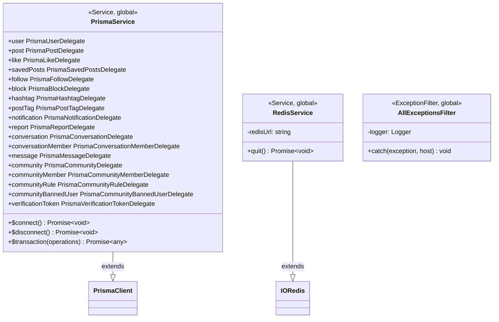

### 3.2 Auth Module

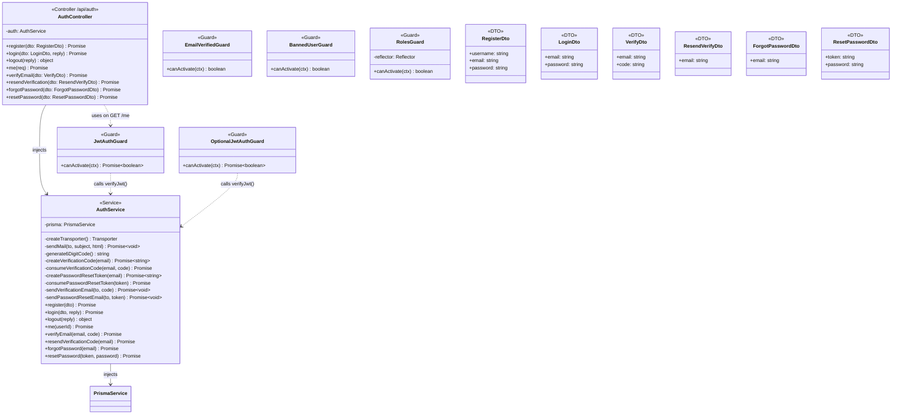

**Endpoint guard chains — AuthController:**

| Method | Path | Guards |
|--------|------|--------|
| POST | `/api/auth/register` | Throttle (10/60s) |
| POST | `/api/auth/login` | Throttle (10/60s) |
| POST | `/api/auth/logout` | — |
| GET | `/api/auth/me` | `JwtAuthGuard` |
| POST | `/api/auth/verify` | Throttle (10/60s) |
| POST | `/api/auth/verify/resend` | Throttle (5/60s) |
| POST | `/api/auth/forgot-password` | Throttle (5/60s) |
| POST | `/api/auth/reset-password` | Throttle (5/60s) |

---

### 3.3 Posts Module

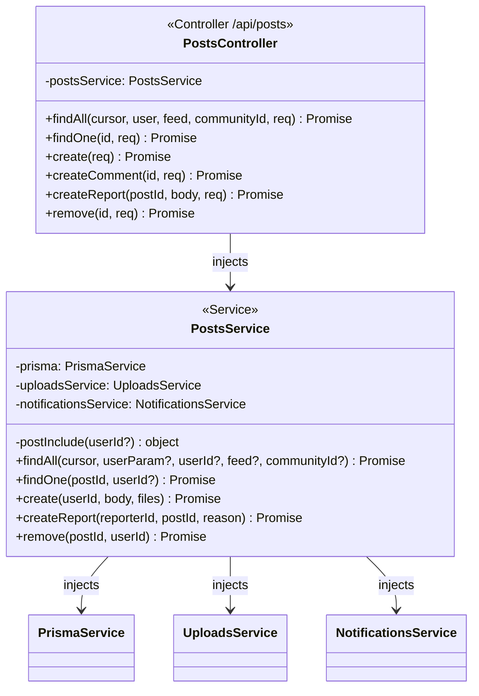

**Endpoint guard chains — PostsController:**

| Method | Path | Guards |
|--------|------|--------|
| GET | `/api/posts` | `OptionalJwtAuthGuard` |
| GET | `/api/posts/:id` | `OptionalJwtAuthGuard` |
| POST | `/api/posts` | `JwtAuthGuard` → `EmailVerifiedGuard` |
| POST | `/api/posts/:id/comments` | `JwtAuthGuard` → `EmailVerifiedGuard` |
| POST | `/api/posts/:id/report` | `JwtAuthGuard` → `BannedUserGuard` |
| DELETE | `/api/posts/:id` | `JwtAuthGuard` → `BannedUserGuard` |

**Key business logic in PostsService.create():**
- Checks community ban and membership before creating post
- Uploads each file via `UploadsService.saveFile()`
- Extracts `#hashtags` → upserts `Hashtag` + `PostTag` records
- Extracts `@mentions` → fires `MENTION` notification (fire-and-forget)
- If reply → fires `REPLY` notification (fire-and-forget)
- If community post by staff → fires `COMMUNITY_NEW_POST` to all members
- If community post by member → fires `COMMUNITY_POST` to mods only; `isApproved: false`

---

### 3.4 Interactions Module

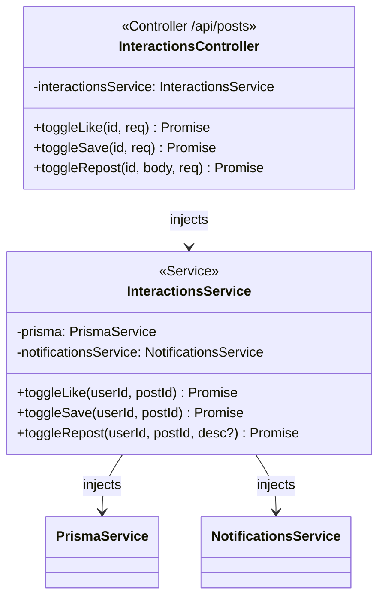

**Endpoint guard chains — InteractionsController:**

| Method | Path | Guards |
|--------|------|--------|
| POST | `/api/posts/:id/like` | `JwtAuthGuard` → `BannedUserGuard` → `EmailVerifiedGuard` |
| POST | `/api/posts/:id/save` | `JwtAuthGuard` → `BannedUserGuard` → `EmailVerifiedGuard` |
| POST | `/api/posts/:id/repost` | `JwtAuthGuard` → `BannedUserGuard` → `EmailVerifiedGuard` |

**toggleRepost logic:** If `desc` is provided → always creates a new quoted repost. If no `desc` → toggle: deletes soft-deleted repost if existing, else creates a plain repost. Fires `REPOST` notification (fire-and-forget) on new reposts.

---

### 3.5 Users Module

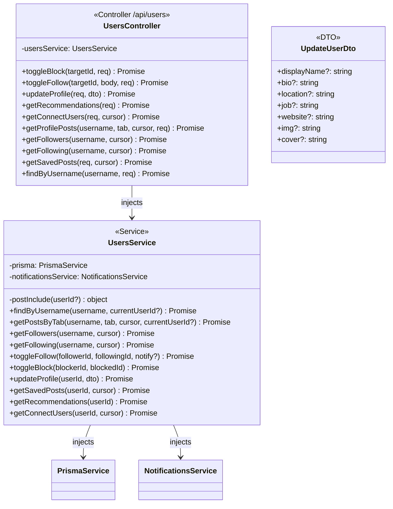

**Endpoint guard chains — UsersController:**

| Method | Path | Guards |
|--------|------|--------|
| POST | `/api/users/:id/block` | `JwtAuthGuard` → `BannedUserGuard` |
| POST | `/api/users/:id/follow` | `JwtAuthGuard` → `BannedUserGuard` |
| PATCH | `/api/users/me` | `JwtAuthGuard` → `BannedUserGuard` |
| GET | `/api/users/recommendations` | `JwtAuthGuard` |
| GET | `/api/users/connect` | `JwtAuthGuard` |
| GET | `/api/users/:username/posts` | `OptionalJwtAuthGuard` |
| GET | `/api/users/:username/followers` | — |
| GET | `/api/users/:username/following` | — |
| GET | `/api/users/me/saved` | `JwtAuthGuard` |
| GET | `/api/users/:username` | `OptionalJwtAuthGuard` |

**toggleBlock side-effect:** Also deletes any existing Follow rows in both directions between the two users (atomic with `Promise.all`).

**getRecommendations algorithm:** Friends-of-friends first (users followed by someone the current user follows, ordered by follower count). Falls back to globally popular users if < 3 results.

---

### 3.6 Notifications Module

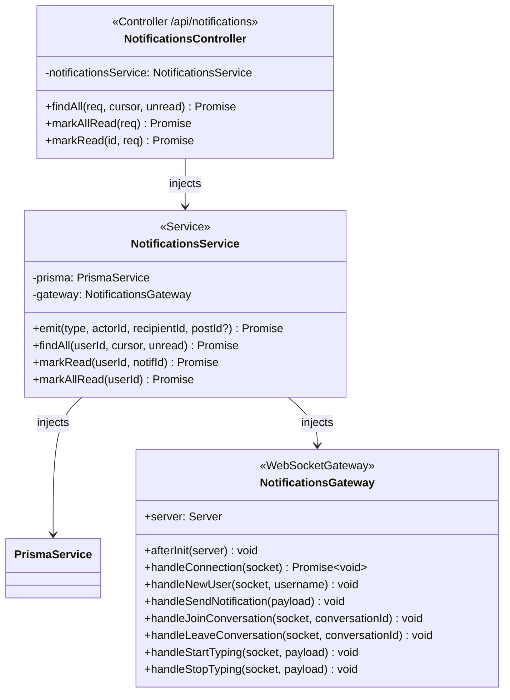

**Endpoint guard chains — NotificationsController:**

| Method | Path | Guards |
|--------|------|--------|
| GET | `/api/notifications` | `JwtAuthGuard` |
| PATCH | `/api/notifications/read-all` | `JwtAuthGuard` |
| PATCH | `/api/notifications/:id/read` | `JwtAuthGuard` |

**NotificationsGateway WebSocket events:**

| Client emits | Server handler | What it does |
|--------------|---------------|--------------|
| `newUser` | `handleNewUser` | `socket.join(username)` — each user gets a private room named after their username |
| `sendNotification` | `handleSendNotification` | Emits `getNotification` to the named room (client-side convenience; service also calls `emit()` directly) |
| `joinConversation` | `handleJoinConversation` | `socket.join("conversation:<id>")` |
| `leaveConversation` | `handleLeaveConversation` | `socket.leave("conversation:<id>")` |
| `startTyping` | `handleStartTyping` | Broadcasts `userTyping` to conversation room (fire-and-forget, no DB) |
| `stopTyping` | `handleStopTyping` | Broadcasts `userStopTyping` to conversation room (fire-and-forget) |

| Server emits | Triggered by | Recipient |
|--------------|-------------|-----------|
| `getNotification` | `NotificationsService.emit()` or `handleSendNotification` | User's private username room |
| `newMessage` | `MessagesService.sendMessage()` | Recipient's private username room |
| `messageRead` | `MessagesService.markRead()` | Other member's private username room |
| `userTyping` | `handleStartTyping` | Conversation room (excluding sender) |
| `userStopTyping` | `handleStopTyping` | Conversation room (excluding sender) |

**NotificationsService.emit() guards:** Silently returns if `actorId === recipientId` — no self-notifications.

**Redis adapter:** `afterInit()` creates two separate `ioredis` clients (pub + sub) and attaches them via `@socket.io/redis-adapter`, enabling WebSocket pub/sub across multiple backend instances.

---

### 3.7 Messages Module

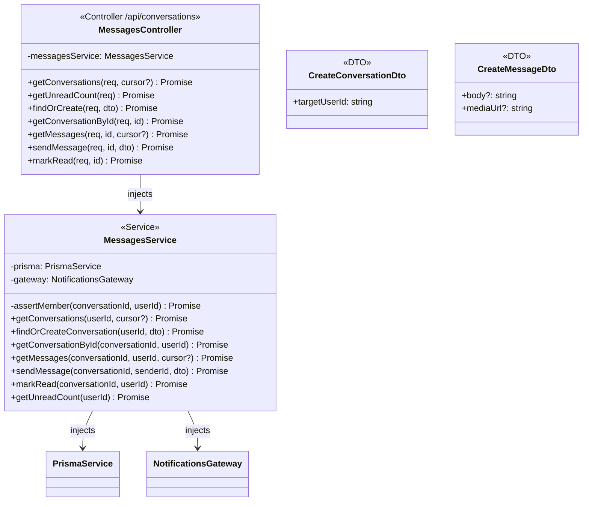

**Endpoint guard chains — MessagesController** (all routes also have controller-level `JwtAuthGuard`):

| Method | Path | Additional Guards |
|--------|------|------------------|
| GET | `/api/conversations` | — |
| GET | `/api/conversations/unread-count` | — |
| POST | `/api/conversations` | `EmailVerifiedGuard` |
| GET | `/api/conversations/:id` | — |
| GET | `/api/conversations/:id/messages` | — |
| POST | `/api/conversations/:id/messages` | `EmailVerifiedGuard` |
| PATCH | `/api/conversations/:id/read` | — |

**sendMessage side-effects:** Uses `prisma.$transaction` to atomically create the `Message` and bump `Conversation.updatedAt`. Then emits `newMessage` via Socket.IO to the recipient's username room. **`markRead`** updates `ConversationMember.lastReadAt` then emits `messageRead` to the other member's room.

---

### 3.8 Communities Module

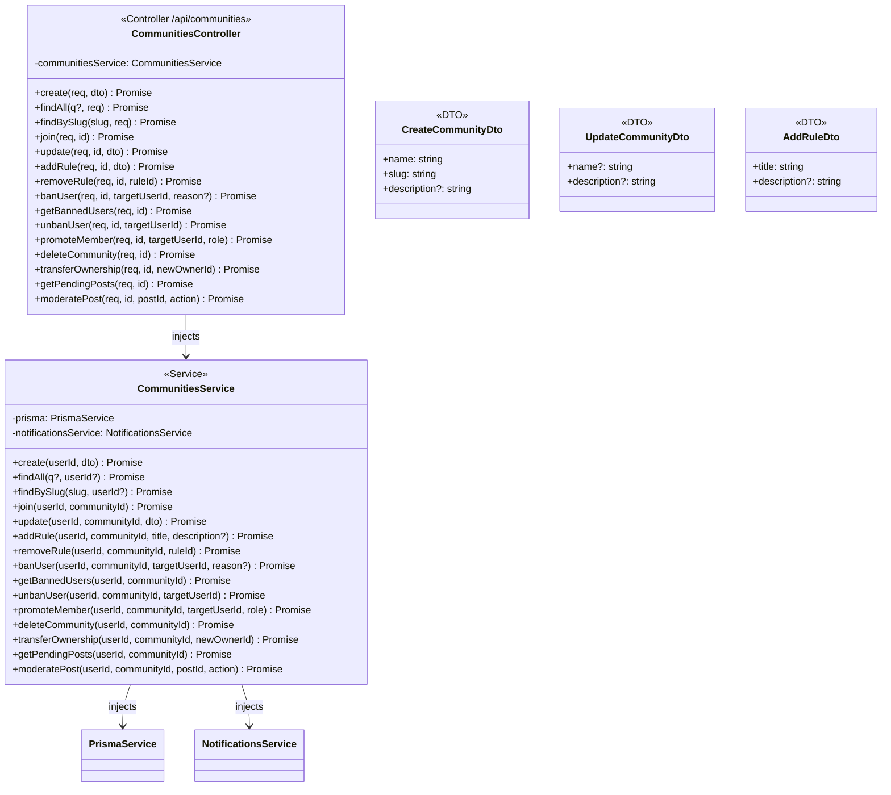

**Endpoint guard chains — CommunitiesController:**

| Method | Path | Guards |
|--------|------|--------|
| POST | `/api/communities` | `JwtAuthGuard` → `EmailVerifiedGuard` |
| GET | `/api/communities` | `OptionalJwtAuthGuard` |
| GET | `/api/communities/:slug` | `OptionalJwtAuthGuard` |
| POST | `/api/communities/:id/join` | `JwtAuthGuard` → `BannedUserGuard` |
| PATCH | `/api/communities/:id` | `JwtAuthGuard` → `BannedUserGuard` |
| POST | `/api/communities/:id/rules` | `JwtAuthGuard` → `BannedUserGuard` |
| DELETE | `/api/communities/:id/rules/:ruleId` | `JwtAuthGuard` → `BannedUserGuard` |
| POST | `/api/communities/:id/ban/:targetUserId` | `JwtAuthGuard` → `BannedUserGuard` |
| GET | `/api/communities/:id/bans` | `JwtAuthGuard` |
| DELETE | `/api/communities/:id/ban/:targetUserId` | `JwtAuthGuard` → `BannedUserGuard` |
| POST | `/api/communities/:id/promote/:targetUserId` | `JwtAuthGuard` → `BannedUserGuard` |
| DELETE | `/api/communities/:id` | `JwtAuthGuard` → `BannedUserGuard` |
| POST | `/api/communities/:id/transfer/:newOwnerId` | `JwtAuthGuard` → `BannedUserGuard` |
| GET | `/api/communities/:id/posts/pending` | `JwtAuthGuard` |
| POST | `/api/communities/:id/posts/:postId/moderate` | `JwtAuthGuard` → `BannedUserGuard` |

**Key service behaviours:**
- `deleteCommunity` uses `prisma.$transaction` — atomically soft-deletes all posts, deletes bans/rules/members, then deletes the community. Only OWNER can trigger.
- `banUser` uses `prisma.$transaction` — upserts ban record and removes the member record in one shot.
- `transferOwnership` uses `prisma.$transaction` — demotes current owner to MOD and promotes new owner atomically.
- `promoteMember` blocks promoting to OWNER (must use `transferOwnership` instead).
- `moderatePost(APPROVE)` sets `isApproved: true` then fans out `COMMUNITY_NEW_POST` to all members (fire-and-forget).
- `moderatePost(REMOVE)` soft-deletes the post.

---

### 3.9 Admin Module

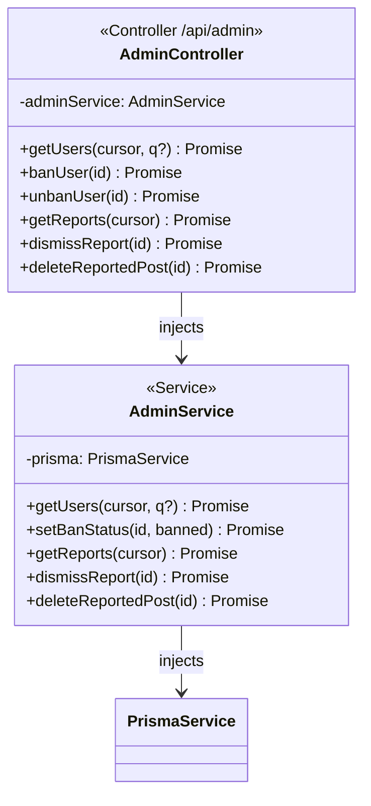

**Endpoint guard chains — AdminController** (all routes have controller-level guards):

| Method | Path | Guards |
|--------|------|--------|
| GET | `/api/admin/users` | `JwtAuthGuard` → `RolesGuard` (`ADMIN`) |
| POST | `/api/admin/users/:id/ban` | `JwtAuthGuard` → `RolesGuard` (`ADMIN`) |
| POST | `/api/admin/users/:id/unban` | `JwtAuthGuard` → `RolesGuard` (`ADMIN`) |
| GET | `/api/admin/reports` | `JwtAuthGuard` → `RolesGuard` (`ADMIN`) |
| POST | `/api/admin/reports/:id/dismiss` | `JwtAuthGuard` → `RolesGuard` (`ADMIN`) |
| DELETE | `/api/admin/reports/:id/delete-post` | `JwtAuthGuard` → `RolesGuard` (`ADMIN`) |

---

### 3.10 Search, Hashtags & Uploads Modules

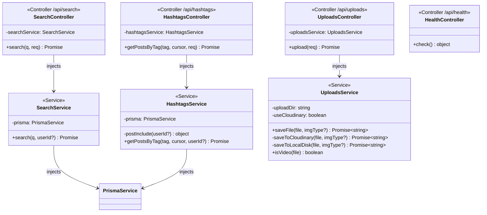

**Endpoint guard chains:**

| Module | Method | Path | Guards |
|--------|--------|------|--------|
| Search | GET | `/api/search` | `OptionalJwtAuthGuard` |
| Hashtags | GET | `/api/hashtags/:tag/posts` | `OptionalJwtAuthGuard` |
| Uploads | POST | `/api/uploads` | `JwtAuthGuard` → `EmailVerifiedGuard` |
| Health | GET | `/api/health` | — |

**UploadsService decision tree:**
```
saveFile(file, imgType?)
 ├─ if CLOUDINARY_CLOUD_NAME is set
 │   ├─ image → upload_stream with transformation:
 │   │   ├─ imgType="square"  → { width:600, height:600, crop:"fill" }
 │   │   ├─ imgType="wide"    → { width:600, height:338, crop:"fill" }
 │   │   └─ default           → { width:1200, crop:"limit" }
 │   │   → quality:"auto", format:"jpg", folder:"breadit"
 │   └─ video → upload_stream as resource_type:"video"
 └─ else (local disk)
     ├─ image → sharp resize → JPEG quality:80 → UUID.jpg → UPLOAD_DIR
     └─ video → raw buffer  → UUID.<ext>       → UPLOAD_DIR
```

**SearchService** runs four parallel Prisma queries: posts (by `desc` ILIKE), users (by `username` or `displayName` ILIKE), hashtags (by `tag` ILIKE), communities (by `name` or `slug` ILIKE). All exclude users/posts blocked by the requesting user. Returns top 5 of each.

---

## 4. Full Dependency Graph

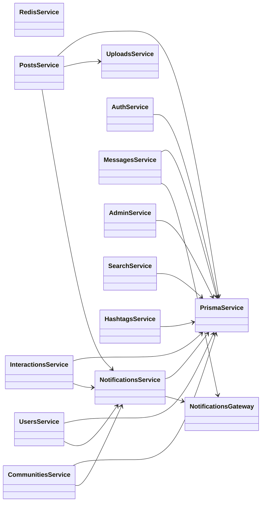

---

## 5. Request Lifecycle

```
HTTP Request
    │
    ▼
ThrottlerGuard (global — 120 req/60s per IP, Redis-backed)
    │
    ▼
Route-level Guards (left to right per endpoint)
  JwtAuthGuard          → reads breadit_session cookie, verifies JWT, attaches req.user
  OptionalJwtAuthGuard  → same but never throws; guests continue with req.user=undefined
  EmailVerifiedGuard    → req.user.emailVerified must not be null
  BannedUserGuard       → req.user.banned must be false
  RolesGuard            → req.user.role must match @Roles() decorator
    │
    ▼
ValidationPipe (global)
  • whitelist: true   → strips any DTO field without a class-validator decorator
  • transform: true   → coerces primitives (string→number, etc.)
    │
    ▼
Controller method → Service method → PrismaService → PostgreSQL
                                   → UploadsService → Cloudinary / Local disk
                                   → NotificationsService → PrismaService + NotificationsGateway
                                   → NotificationsGateway → Socket.IO → Redis pub/sub
    │
    ▼
AllExceptionsFilter (global)
  • HttpException  → its own status + message
  • Other errors   → 500 Internal Server Error
  • Logs method, URL, status, name, message, stack for errors ≥ 500
    │
    ▼
HTTP Response
```

---

## 6. TypeScript / Cross-Cutting Notes

### Shared validation pattern across services

All service methods that mutate community state first assert the caller's `CommunityRole` before proceeding:
- `OWNER` required: `deleteCommunity`, `promoteMember`, `transferOwnership`
- `OWNER` or `MOD` required: `update`, `addRule`, `removeRule`, `banUser`, `unbanUser`, `getBannedUsers`, `moderatePost`, `getPendingPosts`

### Fire-and-forget notification pattern

Several places wrap `Promise.all(...)` in `void` to avoid blocking the response:
```ts
void Promise.all(
  members.map(m => this.notificationsService.emit('COMMUNITY_NEW_POST', actorId, m.userId, postId))
);
```
This means notification delivery failures are silently swallowed — the primary operation (post creation, approval, etc.) still succeeds.

### Prisma generated types

`PrismaService` exposes every model as a typed delegate (e.g., `prisma.user`, `prisma.post`). All query results are fully typed from the generated Prisma Client — no manual interface definitions for DB shapes.

### DTO whitelisting

The global `ValidationPipe({ whitelist: true })` silently strips any request body field that does not appear in the DTO class with a `class-validator` decorator. This prevents property injection attacks without any explicit field-exclusion code.

### JWT payload shape

```ts
{
  sub: string,          // User.id
  username: string,
  email: string,
  emailVerified: string | null,  // ISO datetime string
  role: "USER" | "ADMIN",
  banned: boolean,
  iat: number,
  exp: number           // 30 days from iat
}
```
Guards read `payload.sub` as `req.user.id`, `payload.username`, `payload.emailVerified`, `payload.role`, and `payload.banned`.

---

## 7. System Architecture Diagram

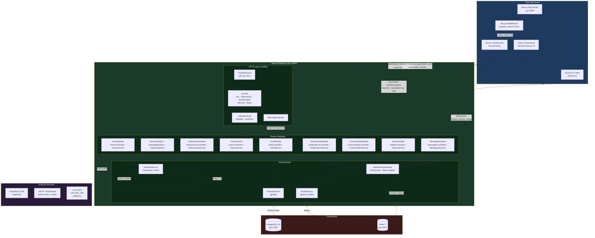

### Component Roles Summary

| Component | Technology | Responsibility |
|-----------|-----------|----------------|
| Next.js App Router | Next.js 15 | SSR pages, middleware auth check, Server/Client component split |
| NestJS + Fastify | NestJS, `@fastify/adapter` | REST API, WebSocket gateway, global guards/pipes/filters |
| PostgreSQL 16 | Prisma ORM | Primary data store — all domain data |
| Redis 7 | ioredis, `nestjs-throttler-storage-redis` | Rate-limit counters + Socket.IO pub/sub across instances |
| Socket.IO Gateway | `@nestjs/websockets`, `@socket.io/redis-adapter` | Real-time notifications and DM delivery |
| Cloudinary | `cloudinary` SDK | CDN media storage with crop/quality transforms (optional) |
| Local disk + sharp | `sharp`, Node `fs` | Media processing fallback when Cloudinary is not configured |
| SMTP (Nodemailer) | `nodemailer` | Transactional email — verification codes and password reset links |

### Data Flow: Creating a Post with Media

```
Browser (Client Component)
  │  POST /api/posts  multipart/form-data
  │  (desc, imgType, communityId?, files[])
  ▼
ThrottlerGuard → JwtAuthGuard → EmailVerifiedGuard
  ▼
PostsController.create()
  │  parses multipart parts manually (Fastify req.parts())
  ▼
PostsService.create()
  ├─ 1. Check community membership + ban      → PrismaService
  ├─ 2. Upload each file                       → UploadsService
  │       ├─ Cloudinary: upload_stream + transform
  │       └─ Local: sharp resize → UUID.jpg → disk
  ├─ 3. prisma.post.create(media[])            → PostgreSQL
  ├─ 4. Upsert Hashtag + PostTag records       → PostgreSQL
  ├─ 5. Fire MENTION notifications             → NotificationsService (void)
  ├─ 6. Fire REPLY notification                → NotificationsService (void)
  └─ 7. Fan-out community notifications        → NotificationsService (void)
          └─ NotificationsService.emit()
                ├─ prisma.notification.create() → PostgreSQL
                └─ gateway.server.to(username).emit('getNotification')
                        └─ Redis pub/sub → all backend instances → Socket.IO client
  ▼
HTTP 201 + post JSON
```

### Data Flow: Direct Message

```
Sender (Client Component)
  │  POST /api/conversations/:id/messages  { body, mediaUrl? }
  ▼
JwtAuthGuard → EmailVerifiedGuard
  ▼
MessagesController.sendMessage()
  ▼
MessagesService.sendMessage()
  ├─ 1. assertMember() — verify sender is in conversation  → PostgreSQL
  ├─ 2. prisma.$transaction([
  │       message.create(),
  │       conversation.update({ updatedAt: now })          → PostgreSQL
  │   ])
  ├─ 3. Look up recipient's username                        → PostgreSQL
  └─ 4. gateway.server.to(recipientUsername)
            .emit('newMessage', { conversationId, message, sender })
                └─ Redis pub/sub → recipient's Socket.IO client
  ▼
HTTP 201 + message JSON

Recipient browser receives 'newMessage' event via WebSocket
  └─ Updates conversation list + chat window in real time
```
