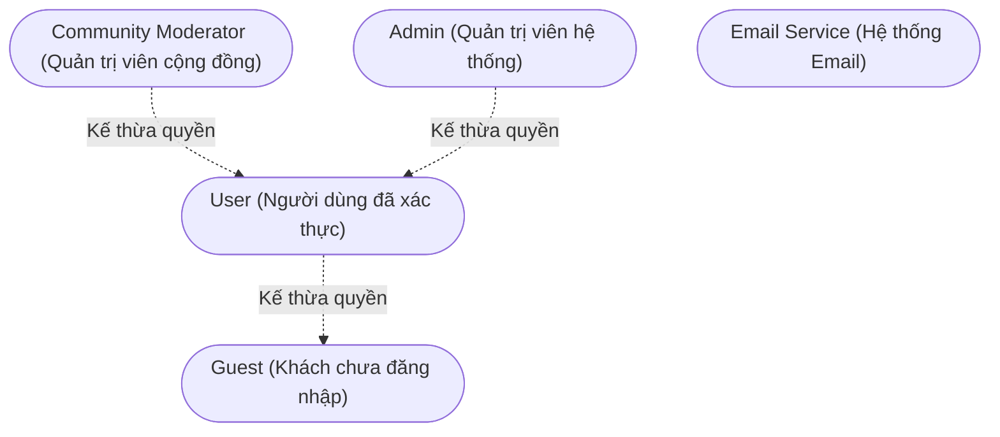
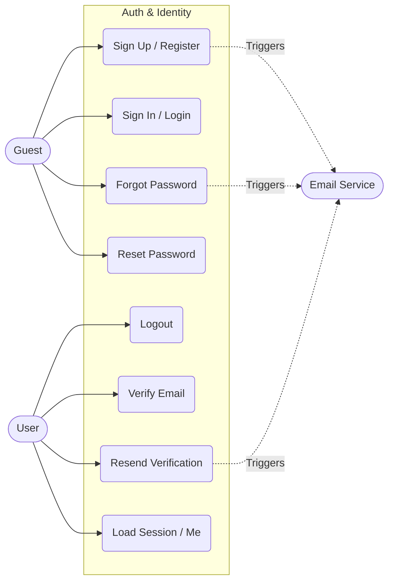
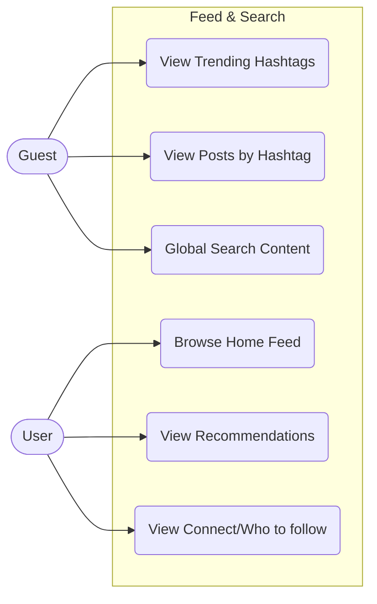
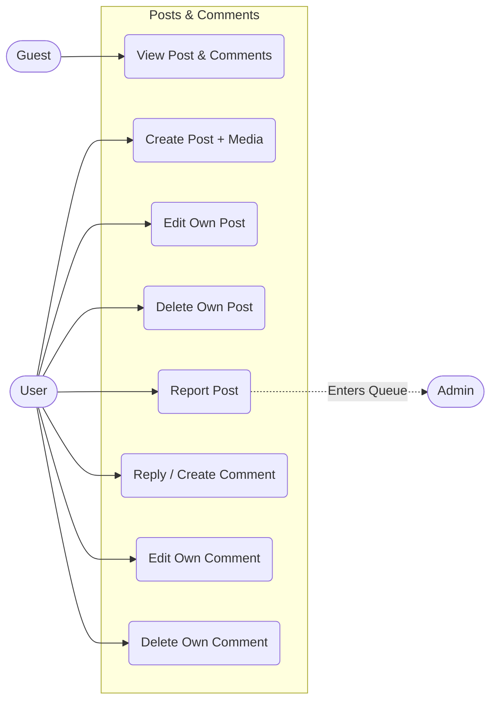
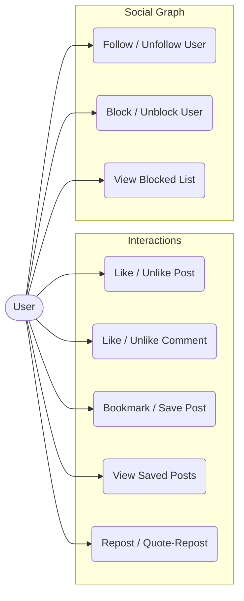
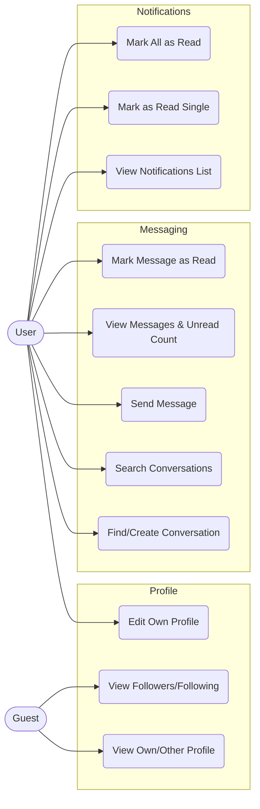
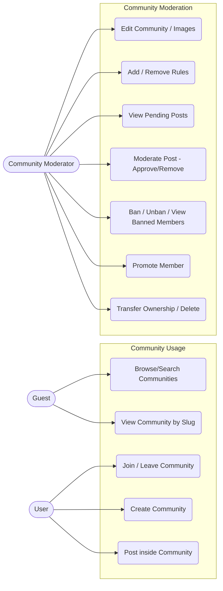
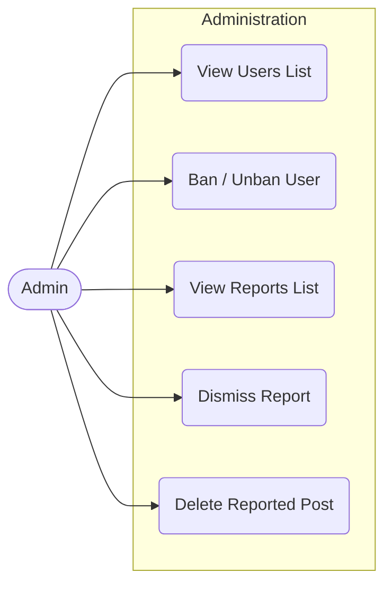

# Breadit (X Clone) - Use Case Diagrams

Biểu đồ này được tôi trích xuất rà soát lại **100% toàn bộ các API Controllers** hiện có trong thư mục `apps/backend/src`. Mọi tính năng hiển thị dưới đây đều ĐÃ ĐƯỢC CODE THỰC TẾ, không bỏ sót bất kỳ một API nào.

## 1. Actor Hierarchy (Sơ đồ phân cấp Actor)

## 2. Phân hệ Authentication (Xác thực & Tài khoản)
*(Dựa trên `auth.controller.ts`)*

## 3. Phân hệ Feed & Discovery (Bảng tin & Khám phá)
*(Dựa trên `posts.controller.ts`, `search.controller.ts`, `hashtags.controller.ts`, `users.controller.ts`)*

## 4. Phân hệ Post & Comment Management (Quản lý Bài viết & Bình luận)
*(Dựa trên `posts.controller.ts`, `comments.controller.ts`)*

## 5. Phân hệ Interactions & Social Graph (Tương tác & Mạng xã hội)
*(Dựa trên `interactions.controller.ts`, `users.controller.ts`, `comments.controller.ts`)*

## 6. Phân hệ Profile, Notifications & Messaging (Hồ sơ, Thông báo & Tin nhắn)
*(Dựa trên `users.controller.ts`, `notifications.controller.ts`, `messages.controller.ts`)*

## 7. Phân hệ Communities (Cộng đồng)
*(Dựa trên `communities.controller.ts`)*

## 8. Phân hệ System Admin (Quản trị hệ thống)
*(Dựa trên `admin.controller.ts`)*

