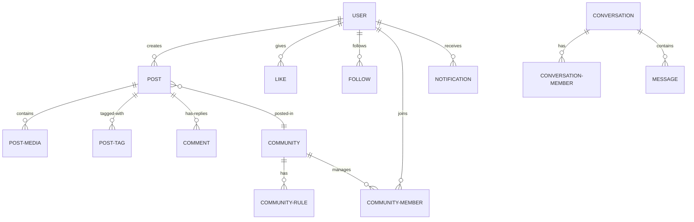

# Database Schema Analysis

This document provides a comprehensive overview of the Breadit database schema, managed via Prisma and PostgreSQL.

## 1. Core User Management

### `User`
The central entity for all platform interactions.
- **Fields:** `id` (cuid), `email`, `username`, `password`, `role` (USER/ADMIN), `banned`.
- **Profile Fields:** `displayName`, `bio`, `location`, `job`, `website`, `img` (avatar), `cover`.
- **Relationships:** Owns posts, likes, saves, follows, notifications, messages, and community memberships.

### `Follow`
Tracks user-to-user social connections.
- **Fields:** `followerId`, `followingId`, `notify` (boolean for notification preference).
- **Type:** Many-to-Many self-relation on `User`.

### `Block`
Allows users to prevent interaction with others.
- **Fields:** `blockerId`, `blockedId`.
- **Type:** Many-to-Many self-relation on `User`.

---

## 2. Content & Social Interaction

### `Post`
The primary content unit.
- **Fields:** `desc`, `isSensitive`, `isApproved`, `deletedAt` (Soft delete).
- **Recursive Relationships:** 
  - `rePostId`: Self-relation for shares/reposts.
  - `parentPostId`: Self-relation for threading (comments).
- **Other Relationships:** Belongs to a `User` and optionally a `Community`. Has multiple `PostMedia`, `Like`, and `PostTag`.

### `PostMedia`
Stores URLs for images/videos attached to posts.
- **Fields:** `url`, `type` (IMAGE/VIDEO/FILE), `height`, `width`.

### `Hashtag` & `PostTag`
Implements many-to-many tagging.
- `Hashtag` stores unique tags (e.g., "#tech").
- `PostTag` is the join table linking `Post` and `Hashtag`.

### `Like` & `SavedPosts`
- Both link a `User` to a `Post`.
- Used for engagement tracking and personal bookmarking.

---

## 3. Communities

### `Community`
A group/subreddit-style entity.
- **Fields:** `name`, `slug` (unique), `description`, `img`, `cover`.
- **Relationships:** Contains `Post`s, `CommunityRule`s, `CommunityMember`s, and `CommunityBannedUser`s.

### `CommunityMember`
Join table between `User` and `Community`.
- **Fields:** `role` (MEMBER, MOD, OWNER).

### `CommunityRule`
Text-based rules for specific communities.

### `CommunityBannedUser`
Tracks users banned from specific communities (distinct from global platform bans).

---

## 4. Messaging System

### `Conversation`
A container for private messages between multiple users.
- **Relationships:** `ConversationMember` (join table), `Message`.

### `ConversationMember`
Links `User` to `Conversation`. Stores `lastReadAt` for unread message tracking.

### `Message`
Individual messages within a conversation.
- **Fields:** `body`, `mediaUrl`, `senderId`.

---

## 5. System & Moderation

### `Notification`
Platform alerts for users.
- **Types:** `LIKE`, `REPLY`, `REPOST`, `FOLLOW`, `MENTION`, `REPORT`, etc.
- **Fields:** `recipientId`, `actorId`, `postId`, `readAt`.

### `Report`
Moderation tool for flagging content.
- **Fields:** `reason`, `status` (OPEN/CLOSED), `reporterId`, `postId`.

### `Account`, `Session`, `VerificationToken`
- **Account/Session:** Currently unused (boilerplate from NextAuth).
- **VerificationToken:** Used for OTP email verification and password resets.

---

## Relationship Diagram (Conceptual)

