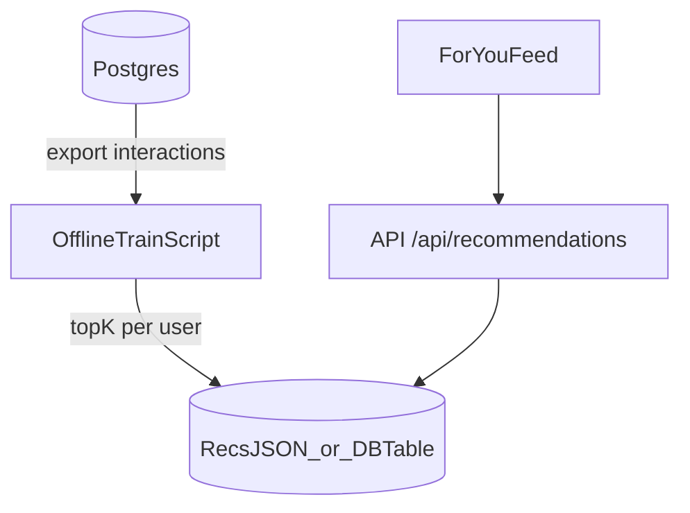

# Thesis plan — Twitter-like Trending & Recommendation (Breadit)

Mục tiêu của tài liệu này là đưa ra một lộ trình **thực thi được** (không over-scope) để phát triển Breadit theo hướng “Twitter-like”:

- **Trending/Explore**: xếp hạng theo **thuật toán (rule-based)**, chạy online/realtime.
- **Recommend/For you**: đề xuất theo **model offline** (batch), có đánh giá bằng metric.

Tài liệu tập trung vào: **scope**, **data pipeline**, **API/contract**, **evaluation**, và **rủi ro**.

---

## 0) Quy ước và scope

### 0.1 Scope “Twitter-like but small”
- Không xây hệ thống streaming (Kafka), không online learning.
- Offline training chạy theo lịch (thủ công cũng được): mỗi ngày/tuần.
- Dữ liệu trong app + seed dataset đủ lớn để demo và đo metric.

### 0.2 Các feed trong Breadit (mục tiêu)
- **Explore (`/?feed=explore`)**: Trending (rule-based)
- **For you (default `/`)**: Recommend (hybrid)
  - Giai đoạn đầu: heuristic fallback (followees + trending boost)
  - Giai đoạn sau: offline model output + guardrails

### 0.3 Chính sách đã chốt (ảnh hưởng ranking)
- **Hashtag feed (Option A)**: loại `communityId != null` và chỉ root posts.
- **Mention policy (Option A)**: mention chỉ notify nếu author follow target.
- **Blocking**: mọi feed/search/notif/DM phải filter blocked peers (đã có).

---

## 1) Milestones theo phase (deliverables rõ ràng)

### Phase 1 — Instrumentation & dataset (1–3 ngày)
**Mục tiêu**: có dữ liệu đủ lớn và log đủ “tín hiệu” để làm ranking + evaluation.

- **(A) Dataset**
  - Dùng `prisma/seed.ts` scale theo env để tạo: users, posts, hashtags, postTags, likes, follows, (optional) reposts/comments.
  - Quy mô tối thiểu khuyến nghị:
    - Users: 200–1000
    - Posts: 5k–30k
    - Likes: 30k–300k
    - Follows: 2k–20k

- **(B) Interaction log (tối thiểu)**
  - Ở mức thesis, “interaction” có thể lấy từ các bảng đã có:
    - Like (`Like`)
    - Repost (Post có `rePostId`)
    - Comment (`Comment`)
    - Follow (`Follow`)
  - Nếu muốn “recommend” tốt hơn: bổ sung **view/click events** (optional):
    - `PostView(userId, postId, createdAt)` hoặc `InteractionEvent(type, ...)`

**Deliverable**:
- Script seed chạy được, có data “đủ nhìn thấy trending”.
- (Optional) bảng view events + endpoint ghi nhận view.

---

### Phase 2 — Trending algorithm cho Explore (2–5 ngày)
**Mục tiêu**: Explore là trending “có decay”, có diversity, và pagination ổn định.

#### 2.1 Scoring (rule-based)
Ví dụ công thức dễ giải thích (tùy bạn chỉnh):

\[
score = a \cdot likes + b \cdot comments + c \cdot reposts - d \cdot ageHours
\]

Gợi ý thực dụng:
- likes = `_count.likes`
- comments = `_count.comments`
- reposts = `_count.rePosts` (hoặc count repost posts)
- ageHours = `(now - createdAt)` theo giờ

#### 2.2 Guardrails
- Filter:
  - `deletedAt = null`, `parentPostId = null`
  - `communityId = null` cho Explore
  - lọc blocked peers
- Diversity:
  - cap số bài liên tiếp cùng author (vd tối đa 2 bài trong top N cửa sổ)

#### 2.3 Pagination ổn định
Yêu cầu:
- ordering deterministic: `(score desc, id desc)` hoặc `(likesCount desc, createdAt desc, id desc)`
- cursor encode theo sort key

**Deliverable**:
- Explore feed “trông đúng”: bài hot nổi lên nhưng tự tụt theo thời gian.
- Không lặp/thiếu khi scroll load-more.

---

### Phase 3 — Recommend baseline (heuristic) cho For you (1–3 ngày)
**Mục tiêu**: trước khi có ML, For you vẫn có logic “recommend-ish”.

Gợi ý baseline:
- candidates = (followees posts) ∪ (trending posts) ∪ (hashtag/community membership signals nếu phù hợp)
- ranking = recency + trending boost nhẹ
- exclude:
  - blocked peers
  - posts đã seen trong session (optional)

**Deliverable**:
- For you không bị “trống”, chất lượng ổn cho demo.

---

### Phase 4 — Offline model (ML nhẹ) cho Recommend (5–14 ngày, tùy thời gian)
**Mục tiêu**: có “AI component” rõ ràng + metric.

#### 4.1 Data for ML
Input dạng implicit feedback:
- Positive interactions: like, repost, comment, (optional) view/click
- Negative sampling: random posts user chưa tương tác

#### 4.2 Model options (thesis-friendly)
Chọn 1 (đủ mạnh nhưng dễ làm):
- Matrix Factorization (implicit)
- LightFM (hybrid nếu bạn muốn thêm user/post features)
- Two-tower đơn giản (nếu bạn thoải mái DL)

#### 4.3 Metrics (không dùng “accuracy”)
- Precision@K, Recall@K, NDCG@K
- Offline split theo thời gian (train trước, test sau) để giống thực tế feed.

#### 4.4 Serving (offline → app)
Không cần inference service online:
- Job offline xuất `topK` recommendations/user ra:
  - **JSON file** (đơn giản), hoặc
  - DB table `UserRecommendation(userId, postId, rank, generatedAt)`
- Backend endpoint `GET /api/recommendations` đọc từ nguồn đó và trả list posts.

**Deliverable**:
- Báo cáo metric + so sánh baseline vs model.
- Endpoint recommend hoạt động trong UI For you.

---

### Phase 5 — Thesis write-up & demo script (2–5 ngày)
**Mục tiêu**: gói lại thành luận văn trình bày logic + minh chứng.

Nội dung nên có:
- Problem statement: trending + recommendation
- Dataset & preprocessing
- Baseline heuristic
- Trending algorithm design + complexity
- Model (nếu làm) + evaluation metrics
- Integration: backend endpoints + UI
- Limitations & future work (online learning, streaming, feature store, etc.)

---

## 2) Kiến trúc tích hợp (gợi ý minimal, phù hợp codebase)

### 2.1 Trending (online, rule-based)
- Implement trong backend `PostsService.findAll(feed=explore)` hoặc tách `TrendingService`.
- Bảo đảm deterministic ordering + cursor.

### 2.2 Recommend (offline, batch)
Luồng đơn giản:

---

## 3) Data management: seed vs SQL snapshot vs Kaggle

- **Seed**: phù hợp dev/thesis, scale nhanh, tái tạo được với `SEED_RANDOM`.
- **SQL snapshot (không phải migration)**: phù hợp import nhanh dataset “frozen” cho demo.
- **Kaggle**: phù hợp train/eval ML, không nên nhét trực tiếp vào migrations.

---

## 4) Rủi ro & cách giảm rủi ro

### 4.1 Dataset mismatch vs business rules
- Nếu import “human pack” bằng SQL: có thể tạo Mention rows mà không có notifications (không chạy service logic).
- Cách giảm rủi ro: tách dataset demo (UI) và dataset train/eval (scale pack).

### 4.2 Reproducibility
- Dùng RNG seed cố định (`SEED_RANDOM`) và snapshot dataset “frozen” cho demo.

### 4.3 Pagination & determinism
- Explore phải có tie-breaker để cursor ổn định; tránh orderBy “mập mờ”.

### 4.4 Cache effects (Redis)
- TTL cache có thể làm UI thấy kết quả “trễ” vài giây sau khi đổi thuật toán.
- Khuyến nghị: thêm `ALGO_VERSION` vào cache key hoặc bump version global.

---

## 5) Checklist “done” cho thesis
- Explore trending có decay + diversity + ổn định pagination.
- For you baseline heuristic hoạt động; (optional) ML model + metrics.
- Dataset scale đủ lớn để chứng minh (không chỉ 25 posts).
- Docs: mô tả rõ policy (blocking, hashtag Option A, mention Option A) và limitations.

